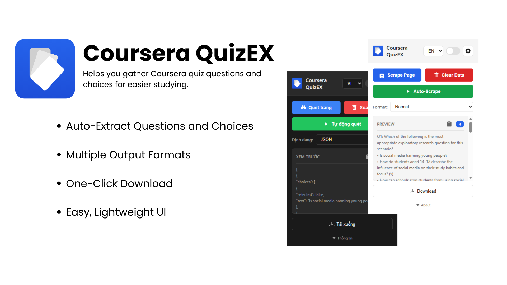

# 🎓 Coursera QuizEX

<p align="left">
  <a href="https://microsoftedge.microsoft.com/addons/detail/coursera-quizex/olobbfckgbnfndihhhabkecheadlpgjd" target="_blank">
    
  </a>
  
  
  
  <a href="https://github.com/QingTian1927/Coursera-QuizEX/releases/latest" target="_blank">
    
  </a>
  
  
</p>

A lightweight browser extension that helps learners **extract quiz questions** from Coursera assignments and convert them into convenient study materials.
Coursera QuizEX lets you gather **question groups** (questions + their choices) and export them in multiple formats for personal learning. ✨



---

## ✨ Features

* **📝 Extract Question Groups:**
  Automatically gathers all questions and their related answer choices from supported Coursera assignment pages.

* **📂 Multiple Output Formats:**
  Choose your preferred export format:

  * **Normal (Human-Readable)** – clean text format for quick review
  * **Formatted** – optimized for importing into flashcard tools (e.g., Quizlet)
  * **JSON** – structured data for custom processing

* **💾 Download Exported Content:**
  Save the extracted output as a **.txt** or **.json** file with a single click.

* **🎛️ Simple, Non-Intrusive UI:**
  Trigger extraction directly through the extension popup while viewing an assignment page.

---

## 📥 Installation

### **👤 User Installation (Recommended)**

You can install Coursera QuizEX in two ways:

#### **1. Install from the Extension Stores**

* [Microsoft Edge Add-ons](https://microsoftedge.microsoft.com/addons/detail/coursera-quizex/olobbfckgbnfndihhhabkecheadlpgjd)
* Google Chrome Web Store (Coming Soon)

#### **2. From a GitHub Release**

1. Go to the **Releases** page of this repository.
2. Download the latest packaged `.zip` file.
3. Open **chrome://extensions/**
4. Enable **Developer Mode** (required only for manually installing a zip).
5. Drag and drop the downloaded `.zip` file into the extensions page.

---

## 🛠️ Installation (Developer Mode)

Use this method if you want to **modify the source code** or contribute:

1. Clone this repository:

   ```bash
   git clone https://github.com/QingTian1927/Coursera-QuizEX.git
   ```
2. Open **chrome://extensions/**
3. Enable **Developer Mode**
4. Click **Load unpacked**
5. Select the cloned project folder

---

## 🚀 Usage

1. Navigate to a Coursera assignment page (e.g., quiz, graded assignment with questions).
2. Open the extension popup.
3. Click **Extract** to collect all question groups on the page.
4. Choose a format (Normal / Formatted / JSON).
5. View or download the output. 💡

https://github.com/user-attachments/assets/4882e0ef-a136-40f8-8dc4-7bcab797f3e2

---

## 📁 Output Examples

### **Normal (Human-Readable)**

```
Q1: Which of the following is the most appropriate exploratory research question for this scenario?
• Is social media harming young people?
• How do students aged 14–18 describe the influence of social media on their study habits and focus? (x)
• How can schools stop students from using social media during study time?
• Why do students use TikTok so much?
```

### **Formatted (Quizlet-Friendly)**

```
Which of the following is the most appropriate exploratory research question for this scenario?

Is social media harming young people?
How do students aged 14–18 describe the influence of social media on their study habits and focus?
How can schools stop students from using social media during study time?
Why do students use TikTok so much?
/How do students aged 14–18 describe the influence of social media on their study habits and focus?;
```

### **JSON**

```json
[
  {
    "number": "1",
    "question": "Which of the following is the most appropriate exploratory research question for this scenario?",
    "choices": [
      {
        "text": "Is social media harming young people?",
        "selected": false
      },
      {
        "text": "How do students aged 14–18 describe the influence of social media on their study habits and focus?",
        "selected": true
      },
      {
        "text": "How can schools stop students from using social media during study time?",
        "selected": false
      },
      {
        "text": "Why do students use TikTok so much?",
        "selected": false
      }
    ],
    "correct": true
  }
]
```

---

## ⚠️ Notes & Limitations

* This extension is intended strictly for **personal study and revision**.
* It **does not complete quizzes or assignments for you** – it only helps you review content already visible on the page.
* Works only on **Coursera assignment pages** where questions and choices are displayed in the DOM (i.e., content you have already accessed yourself).
* Not affiliated with or endorsed by Coursera.

---

## 🤝 Contributing

Contributions are welcome! 🎉
Feel free to submit a pull request or open an issue with suggestions or improvements.
